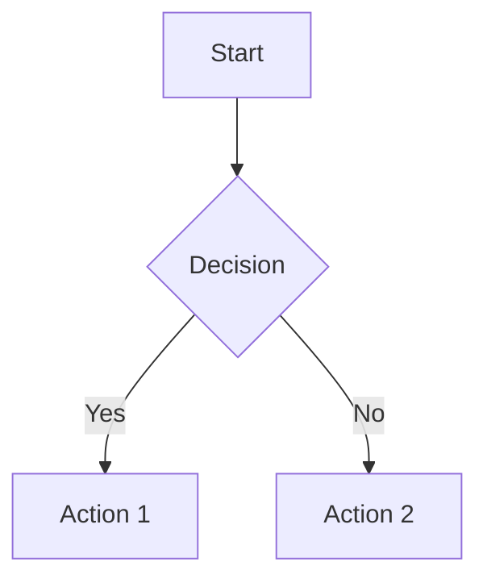

# Welcome to My Presentation

A subtitle for the title slide

---

## Slide with Content

- Bullet point 1
- Bullet point 2
- **Bold text** and *italic text*

---

### Code Examples

```javascript
function hello() {
  console.log("Hello My Presentation!");
}
```

---


# Background Image Slide

Text over background image

<!-- Slide-specific directives start with underscore -->

<!-- _class: lead -->
# Lead Style Slide

---

<!-- _backgroundColor: #1e3a8a -->
<!-- _color: white -->
## Blue Background Slide

White text on blue background

---

<!-- _paginate: false -->
## No Page Number

This slide won't show page numbers

---


## Split Layout

Background image on the left,
content on the right

---


## Fitted Background

Image fits within slide bounds

---

<!-- footer: "My Footer Text" -->
## Footer Added

All following slides will have footer

---

<!-- header: "Chapter 1" -->
## Header Added

Header appears on this and following slides

---

<!-- _class: lead -->
# Advanced Slide Features

---

<!-- _backgroundColor: aqua -->
## Custom Background Color

This slide has a custom background

---

<!-- _color: red -->
## Custom Text Color

Red text on this slide

---

## Two Column Layout

<div class="columns">
<div>

### Left Column
- Point 1
- Point 2

</div>
<div>

### Right Column
- Point A
- Point B

</div>
</div>

---

## Math Formulas

Inline math: $E = mc^2$

Block math:
$$
\int_0^\infty e^{-x^2} dx = \frac{\sqrt{\pi}}{2}
$$

---

## Mermaid Diagrams

