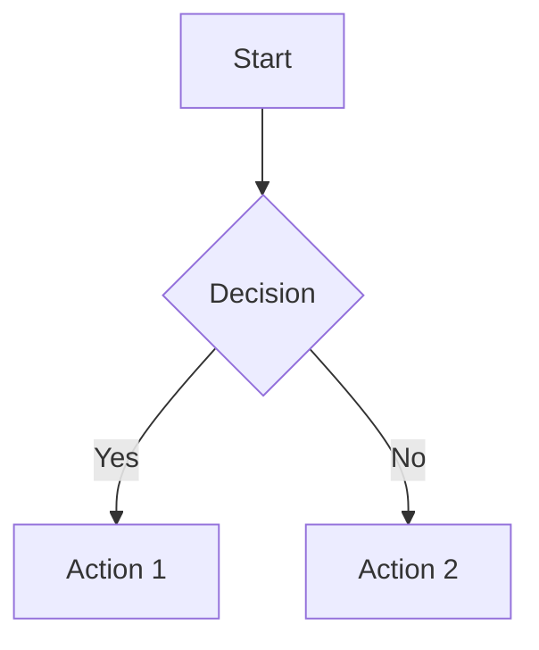

# Welcome to My Presentation

A subtitle for the title slide

---

## Slide with Content

- Bullet point 1
- Bullet point 2
- **Bold text** and *italic text*

<!-- Notes:
This is a quick overview of what the full presentation covers.

Slide 1 — Title slide: introduce yourself and the topic.
Slide 2 — This slide: core content with bullets and inline formatting.
Slide 3 — Code examples: show a live JavaScript snippet.
Slide 4 — Background image: full-bleed photo with text overlay.
Slide 5 — Lead style: centred, high-impact statement slide.
Slide 6 — Colour override: dark blue background with white text.
Slide 7 — No page number: demonstrating the _paginate directive.
Slide 8 — Split layout: image on the left, content on the right.
Slide 9 — Fitted background: image scaled to fit within slide bounds.
Slide 10 — Footer: persistent footer text added from this slide onward.
Slide 11 — Header: persistent header text added from this slide onward.
Slide 12 — Advanced features overview.
Slide 13 — Custom background colour using _backgroundColor directive.
Slide 14 — Custom text colour using _color directive.
Slide 15 — Two-column layout using raw HTML div.columns.
Slide 16 — Math formulas rendered with KaTeX.
Slide 17 — Mermaid diagrams rendered as flowcharts.
Slide 18 — Presenter notes demo (this very feature you are looking at).

Tip: use the Notes tab in the editor to read speaker notes while you rehearse.
-->

---

### Code Examples

```javascript
function hello() {
  console.log("Hello My Presentation!");
}
```

---


# Background Image Slide

Text over background image

<!-- Slide-specific directives start with underscore -->

<!-- _class: lead -->
# Lead Style Slide

---

<!-- _backgroundColor: #1e3a8a -->
<!-- _color: white -->
## Blue Background Slide

White text on blue background

---

<!-- _paginate: false -->
## No Page Number

This slide won't show page numbers

---


## Split Layout

Background image on the left,
content on the right

---


## Fitted Background

Image fits within slide bounds

---

<!-- footer: "My Footer Text" -->
## Footer Added

All following slides will have footer

---

<!-- header: "Chapter 1" -->
## Header Added

Header appears on this and following slides

---

<!-- _class: lead -->
# Advanced Slide Features

---

<!-- _backgroundColor: aqua -->
## Custom Background Color

This slide has a custom background

---

<!-- _color: red -->
## Custom Text Color

Red text on this slide

---

## Two Column Layout

<div class="columns">
<div>

### Left Column
- Point 1
- Point 2

</div>
<div>

### Right Column
- Point A
- Point B

</div>
</div>

---

## Math Formulas

Inline math: $E = mc^2$

Block math:
$$
\int_0^\infty e^{-x^2} dx = \frac{\sqrt{\pi}}{2}
$$

---

## Mermaid Diagrams


```mermaid
graph TD
    A[Start] --> B{Decision}
    B -->|Yes| C[Action 1]
    B -->|No| D[Action 2]
```

---

## Slide with Presenter Notes

This slide demonstrates extended speaker notes.

- Key point for the audience
- Supporting detail to mention verbally

<!-- Notes:
Welcome everyone to this section on presenter notes.

When presenting this slide, make sure to:
1. Pause after the first bullet point and ask if anyone has questions.
2. Emphasise that the bullet points are a summary — the full story is in the notes.
3. Mention the related case study from Q3, which shows a 40% improvement in outcomes when teams adopted this approach.

Additional context:
- The data backing these points comes from the 2024 internal survey (n=320).
- There is an ongoing pilot with the Berlin team — results expected in April.
- If the audience asks about edge cases, refer them to Appendix B in the handout.

Time check: this slide should take about 3 minutes. If you are running short on time, skip the second bullet and move straight to the demo.
-->